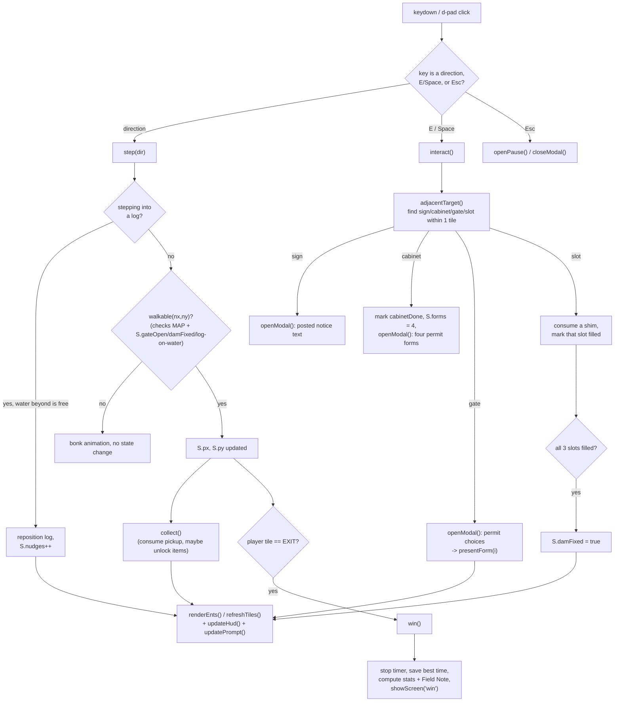

# MazeQuest Mini — Technical Documentation

Technical reference for the `mazequest-mini` prototype: what it is, what each
script does, and how the pieces talk to each other at runtime. Pairs with
the top-level [`README.md`](../README.md) (quick start, how to play) and
[`docs/MazeQuest_Mini_PRD.md`](MazeQuest_Mini_PRD.md) (the design spec this
code implements).

---

## 1. Project Overview

**Name:** MazeQuest Mini — *The Dam Auditor*
**Genre:** Top-down, single-level puzzle adventure. Grid-based movement,
Sokoban-style push puzzle, inventory-gated progression, no combat and no
fail state.
**Objective:** The player controls Inspector Bertie Castorum, a beaver
auditor for the Woodland Bureau of Aquatic Infrastructure, crossing a single
maze level — *"The North Culvert Circuit"* — to clear three compliance
puzzles and formally "file" the Central Filing Dam.

**Gameplay mechanics, in brief:**

- **Movement** — four-directional, tile-to-tile (WASD / arrow keys / on-screen
  d-pad), one tile per keypress, with key-repeat while a direction is held.
- **Interaction** — a context-sensitive "inspect" action (`E` / `Space` / d-pad
  center button) triggers whatever the player is standing next to: reading a
  sign, opening a filing cabinet, presenting a permit at a gate, or driving a
  shim into a dam slot.
- **Puzzle 1 (the log raft)** — a Sokoban-style push puzzle. Three logs must
  be arranged into a 3-tile bridge. Solvable two ways that write to the same
  state: click a log then click an adjacent open-water tile ("nudge"), or
  walk directly into a log to push it.
- **Puzzle 2 (the permit gate)** — an inventory/knowledge check. The player
  collects four permit forms from a filing cabinet (one correct, three
  decoys) and must present the one matching a posted code at a locked gate.
- **Puzzle 3 (the leaky dam)** — a collect-and-return puzzle. Three shims,
  found off the critical path, are each driven into one of three slots on a
  cracked dam face to drain a flooded exit corridor.
- **Collectibles** — six acorn stamps and three supply crates (off the
  critical path), where crates unlock cosmetic items for the customize
  screen.
- **Field Desk (customize screen)** — three equipment slots (hat, implement,
  pelt; four options each = 64 combinations), where changing any slot
  regenerates a one-paragraph "Field Notes" description live, assembled from
  a template rather than hand-written per combination.
- **Persistence** — unlocked items, current loadout, and best clear time are
  saved to `localStorage` (best-effort; the game still runs if storage is
  blocked).

**Tech stack:** No framework, no build-time dependency, no server. The
shipped artifact is a single self-contained HTML file — inline CSS, inline
vanilla JavaScript (one IIFE, ES5-leaning syntax), and the character
portrait embedded as a base64 data URI — assembled from source parts by a
small Python build script. Opening the file in a browser is the entire
deployment story.

---

## 2. Code Overview

The repository separates **runtime code** (what ships inside the game),
**build/validation tooling** (Python scripts run by hand, not by the
browser), and **design source** (the PRD and UI mockups the code
implements). All of it was produced with AI assistance from the PRD in
`docs/MazeQuest_Mini_PRD.md`.

| File | Role | Purpose |
|---|---|---|
| `game/part1_style.html` | Runtime — CSS | The entire visual design system: color tokens (`oklch()`), the five full-screen views, the tile board grid, HUD cards, modal/toast/d-pad styling, and the Field Desk slot layout. Pure `<style>`, no logic. |
| `game/part2_markup.html` | Runtime — HTML | Static markup: an inline SVG `<symbol>` sprite sheet (every icon/glyph used in the game, referenced elsewhere via `<use href="#id">`), and the five `<section class="screen">` blocks — Start Menu, How to Play, Field Desk, Game (HUD + board + d-pad), Win — plus the shared modal/toast/"DENIED" stamp overlay elements. No inline script. |
| `game/part3_script.html` | Runtime — JavaScript | The entire game engine. One `<script>` tag, one IIFE, ~900 lines, organized into 17 numbered sections (detailed in §3). This is where level data, state, rendering, input, and all three puzzles' logic live. |
| `game/assemble.py` | Build tool | Concatenates `part1` + `part2` + `part3`, substitutes the `__BERTIE__` placeholder with a base64 `data:` URI of `bertie.png`, and writes two outputs: `mazequest-mini.html` (fragment only — no `<!doctype>`/`<html>`/`<head>`/`<body>`, for embedding) and `MazeQuest-Mini.html` (a complete standalone document, the one meant to be opened directly in a browser). Not run by the game itself — a developer re-runs it after editing any `part*.html` file. |
| `game/build_map.py` | Build/validation tool | Generates the level's 25×17 tile grid from small composable primitives (`hline`, `vline`, `rect`), declares every entity's fixed coordinates (start, exit, gate, filing cabinet, signpost, dam slots, log holding positions, shims, crates, acorns), then runs a breadth-first-search reachability check at each of the four puzzle-progress stages (nothing solved → raft built → gate open → dam fixed) to prove nothing is soft-locked, no area is reachable before its gating puzzle is solved, and every log has a valid all-water push route to its lane slot. Prints the finished grid as both an ASCII map and a ready-to-paste JS array literal — the actual `MAP` constant in `part3_script.html` is this script's output, copied in by hand. This makes `build_map.py` the source of truth for the level layout; the level in `part3_script.html` is a generated artifact of it, not maintained independently. |
| `game/playtest.py` | Validation tool | A Playwright end-to-end smoke test. Launches headless Chromium against the assembled standalone HTML and drives one full playthrough via simulated keypresses and DOM clicks — menu → How to Play → Field Desk (checks 9 of 12 items start locked) → start run → read the notice → optional Meadow Cache loop → solve the raft puzzle → cross to the Old Survey Shed → open the cabinet → attempt the gate with a deliberately wrong permit (confirms the DENIED state), then the correct one → solve the dam puzzle → reach the exit and confirm the win screen → reopen the Field Desk post-win (confirms all 12 items now unlocked) → swap the whole loadout and confirm the Field Notes text rewrites. Asserts on DOM/text state at each checkpoint and screenshots every stage. Not part of the shipped game; a regression check a developer runs manually. |
| `game/bertie.png` | Asset | The character portrait, embedded into the build as a base64 data URI by `assemble.py`. |
| `docs/MazeQuest_Mini_PRD.md` | Design source | Not code. The product requirements doc — concept, character design, level layout, puzzle specs, UI spec, and the full Field Desk item/flavor-text tables. The scripts above are an implementation of this document; where the two disagree, treat the PRD as intent and the code as current behavior. |
| `design/*.dc.html`, `design/canvas.json` | Design source | Claude Design canvas artboards (Start Menu, Gameplay HUD, Field Desk) used as UI reference mockups during design. Not loaded or referenced by the game at runtime. |

---

## 3. Game Architecture & Logic Flow

### 3.1 Overall shape

Everything runtime-relevant lives in one closure in `part3_script.html`,
split into 17 labeled sections read top-to-bottom:

```
1. Level data (MAP + fixed coordinates)      10. Interactions (cabinet/gate/dam/sign)
2. Loadout data (hats/implements/pelts)       11. HUD, toasts, modals
3. Persistence (load/save via localStorage)   12. Pause + timer
4. Generic helpers ($ , key, svg, mmss...)    13. Win
5. Game state (S, freshState())               14. Screens (showScreen, startGame)
6. Board rendering                            15. Input (keyboard + d-pad)
7. Interaction targets (adjacentTarget)       16. Field Desk (customize screen)
8. Movement (step)                            17. Boot
9. Puzzle 1 — the log raft
```

There is no class hierarchy and no virtual-DOM/diffing layer: the code is
plain functions operating on a small number of shared objects, followed by
an explicit re-render call. It is, in effect, a hand-rolled version of the
classic **update state → re-render → read input → repeat** game loop, driven
by DOM events (`keydown`, `click`) rather than a `requestAnimationFrame`
tick — the only running timer is a 1-second interval that increments the
elapsed-time counter (§12).

### 3.2 Core data objects

| Object | Scope | Contents |
|---|---|---|
| `MAP` + derived constants (`START`, `EXIT`, `GATE`, `CABINET`, `SIGN`, `SLOTS`, `LANE`, `FLOOD`, `CRATES`, `FORMS`, `POSTED_CODE`) | Static, module-level | The 25×17 ASCII level grid and every fixed coordinate/content table derived from it. Never mutated. |
| `ITEMS`, `SLOT_META`, `PELT_TINT` | Static, module-level | The Field Desk's 4×4×4 hat/implement/pelt catalog, its slot metadata, and the CSS filter used to visually tint each pelt. |
| `L` | Persisted, cross-playthrough | The currently equipped `{hat, implement, pelt}` loadout. |
| `unlocked` | Persisted, cross-playthrough | `Set` of unlocked item ids; starts with the three free defaults. |
| `best` | Persisted, cross-playthrough | Fastest clear time in seconds, or `null`. |
| `S` | Ephemeral, one per playthrough | Everything that changes during a single run: player position/facing, log positions, remaining pickups, counters (acorns/shims/forms/nudges/denied), puzzle-solved flags (`raft`, `gateOpen`, `damFixed`, `slotsFilled[]`), elapsed seconds, and `running`/`done` flags. Rebuilt from scratch by `freshState()` every time **Play** is pressed with a fresh run. |

`L`, `unlocked`, and `best` survive a "Run it again," because only `S` is
reset; the Field Desk's unlocks and chosen loadout persist across the whole
session (and across browser reloads, via `localStorage`).

### 3.3 Character → level → UI update chain



Every state-changing function funnels back through the same handful of
render calls (`renderEnts`, `refreshTiles`, `updateHud`, `updatePrompt`)
rather than mutating the DOM inline — that's the closest thing this codebase
has to a "level manager ↔ UI" boundary. `objectiveText()` (used by the HUD's
"current objective" card) reads no separate quest/step state at all; it
derives the current goal purely from the same `S.sawRiver` / `S.raft` /
`S.hasForms` / `S.gateOpen` / `S.damFixed` booleans that gate movement,
so the HUD text and the actual puzzle-gating logic can never drift out of
sync.

**Puzzle 1 has two input paths into one state change.** Both the board's
`click` listener (log-select → nudge-dot click) and `step()`'s
walk-into-a-log case reposition a log and call `checkRaft()`, which flips
`S.raft = true` once all three `LANE` tiles hold a log — so the puzzle is
equally solvable by mouse, keyboard, or a mix of both, matching the PRD's
§5.2 requirement.

**Puzzle 2 and Puzzle 3 read directly off `walkable()`.** `walkable(x, y)`
treats a `G` (gate) tile as passable only if `S.gateOpen`, and an `F`
(flood) tile as passable only if `S.damFixed` — so opening the gate or
fixing the dam doesn't just change UI state, it changes what tiles the
collision map will accept the very next step.

### 3.4 Screen manager

Five `<section class="screen">` blocks (menu / howto / custom / game / win)
share one CSS class toggle: `showScreen(id)` removes `.on` from all of them
and adds it to `#scr-<id>`. A single delegated `document` click listener
looks for any element with `data-go="<id>"` and calls either `showScreen`
directly, or `startGame(fresh)` when the target is `"game"` — `fresh="1"`
(present on the menu's Play button and the win screen's "Run it again")
tells `startGame` to call `freshState()`; without it, resuming from the
Field Desk mid-run reuses the existing `S`.

### 3.5 Sequence of events, start to end

1. **Page load.** The IIFE runs once: it reads the portrait `` src into
   `PORTRAIT`, calls `load()` to restore `L` / `unlocked` / `best` from
   `localStorage`, then `updateMenuRecord()` and `renderDesk()` paint the
   "best circuit" line and the Field Desk. The Start Menu screen is already
   `.on` in the static markup, so nothing else needs to run for the menu to
   be visible.
2. **Play.** `data-go="game" data-fresh="1"` → `startGame(true)`:
   `freshState()` rebuilds `S` (player at `START`, three logs at their `L`
   positions in `MAP`, every `a`/`m`/`k` tile turned into a live pickup) →
   `buildBoard()` creates the 25×17 tile `<div>` grid once → `renderEnts()`
   places pickups, logs, the player sprite, and the (hidden) interaction
   prompt → `updateHud()` → `S.running = true` → `startTick()` starts the
   1 Hz elapsed-time interval → `showScreen('game')` → the board is
   focused for keyboard input → a delayed toast points the player at the
   signpost.
3. **Moment-to-moment play.** Every keypress or d-pad click is routed
   through `step()` or `interact()` as diagrammed in §3.3, gated on
   `S.running && !S.done` (and further gated on the modal being closed).
   Both funnel back through the shared render/HUD/prompt calls.
4. **Puzzle order is soft-gated, not scripted.** There's no separate quest
   graph — the reachability rules baked into `walkable()` (§3.3) are exactly
   what `build_map.py`'s BFS validated at build time: the raft must exist
   before the east bank (and the Survey Shed / gate) is reachable, the gate
   must be open before the dam yard is reachable, and the dam must be fixed
   before the flood-covered final corridor is passable. Off-path loops
   (Meadow Cache, the hidden nook past the dam) are reachable at every
   stage.
5. **Reaching `EXIT`.** `step()`'s final check calls `win()`: stops the
   timer, records a new best time if applicable, computes the run summary
   (elapsed time, acorns / 6, log nudges, permits denied) and the current
   Field Note text, persists via `save()`, and shows the Win screen.
6. **Post-win.** From the Win screen the player can restart (a fresh `S`,
   same persisted `L`/`unlocked`/`best`), open the Field Desk (all items
   collected during the run are now unlocked and selectable), or return to
   the Menu, which now shows the recorded best time.

### 3.6 What's build-time-only vs. shipped

`assemble.py`, `build_map.py`, and `playtest.py` never run in the player's
browser — only `part1_style.html` + `part2_markup.html` + `part3_script.html`
(as stitched together into `MazeQuest-Mini.html`) ship. `build_map.py` in
particular is a design-time authoring tool: its BFS output is manually
copied into the `MAP` constant, so the level in `part3_script.html` and the
level `build_map.py` generates can, in principle, drift apart if one is
edited without regenerating/re-pasting from the other — worth checking when
touching level geometry.

---

## Regenerating the build

```bash
cd game
python3 assemble.py        # rebuilds MazeQuest-Mini.html from the 3 parts
python3 build_map.py       # re-validates/regenerates the map (prints the JS literal to paste into part3_script.html)
python3 playtest.py        # full-playthrough smoke test via Playwright, screenshots to /tmp/mazequest_app/shots
```
